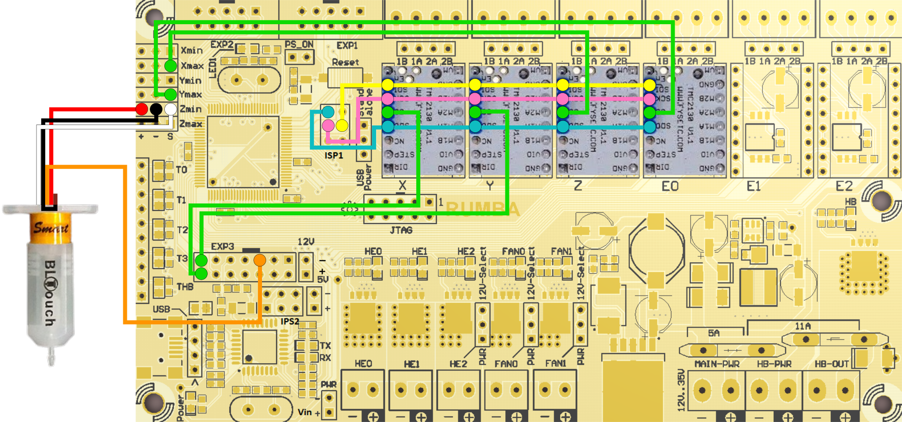

# Marlin 3D Printer Firmware
This is a fork from [Marlin Firmware](https://github.com/MarlinFirmware/Marlin).  
Additional documentation can be found at the [Marlin Home Page](https://marlinfw.org/).  
Marlin is published under the [GPL license](/LICENSE).

## Configuration for BigBox
This is a Marlin 2.0.9.1 configuration for a BigBox Pro with a BLTouch and TMC2130 drivers on X, Y, Z and E.

The wiring should follow this wiring diagram in order to work with this configuration. If your implementation is different please modify the pins_RUMBA.h file and/or configuration files.

</img> 

## Responsability
Please review the firmware before installing it on your board. This is provided as a guideline but may not work with your printer.

Things to watch out for :
- Motor direction
- Axis limits
- E-steps (if you have a different extruder)

I am not responsible for any damages or harm cause by the use of this firmware.

## Misc
Start gcode :
M140 S\[first_layer_bed_temperature] ; set bed temp 
M104 S\[first_layer_temperature] ; set extruder temp 
G28 ;home all 
M420 S1 ;activate bed leveling 
G1 Z5 F5000 ; lift nozzle 
M190 S\[first_layer_bed_temperature] ; wait for bed temp 
M109 S\[first_layer_temperature] ; wait for extruder temp 

End gcode : 
M104 S0 ; turn off hotend 
M140 S0 ; turn off bed 
M211 S0 ; disable software endstops 
G0 X100 F3000 ; park X first 
G0 Y230 F3000 ; park Y 
M211 S1 ; enable software endstops 